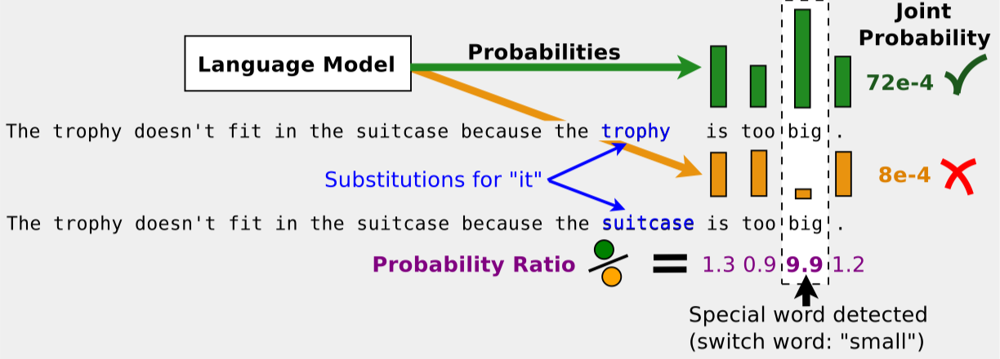

Improving Language Understanding for Low-Resource Languages with Generative Pre-Training
===============================================

<strong><em>Table of Contents</em></strong>

<!-- TOC -->

- [Overview](#overview)
    - [Research Overview](#research-overview)
- [Experiments](#experiments)
    - [Generative Language Modeling Pre-Training](#generative-language-modeling-pre-training)
        - [Language Model Training with Tensor2Tensor](#language-model-training-with-tensor2tensor)
        - [Lessons Learned](#lessons-learned)
    - [Neural Machine Translation Baselines](#neural-machine-translation-baselines)
- [Training Data and Evaluation](#training-data-and-evaluation)
    - [Language Model Datasets](#language-model-datasets)
    - [Multi-task Benchmarks for English](#multi-task-benchmarks-for-english)
- [Acknowledgement](#acknowledgement)

<!-- /TOC -->

## Overview

In this project we examine the ability to use generative pre-training with language modeling objectives across a variety of languages for improving language understanding. Particular interest is spent on transfer learning to low-resource languages, where label data is scare.

Pre-training and generative modeling for improved language understanding in NLP remains a challenging but interesting area of research and experimentation. Currently, most SOTA NLP results are obtained by training end-to-end architectures for each language task. We examine how transformer models relying solely on attention modules, as well as convolution-only modules such as Q-RNN and those described in QANet can provide rich representations learned through generative language modeling and then fine-tuned for text classification as well as general multi-task problems. Of particular interest will be multi-label and hierarchical/structured output label classification where graph convolutional and value networks are more effective than binary categorical cross-entropy networks.

### Research Overview

In the past few months, a number of techniques utilizing pre-training, generative modeling, multi-task architectures, data augmentation using back-translation, and efficiency techniques in language modeling have been implemented that have allowed faster training and greater scope for transfer learning. In particular, the five papers below tackle the problem of generative pre-training and multi-task learning in NLP and achieve SOTA results.

1. [OpenAI: Improving Language Understanding by Generative Pre-Training](https://blog.openai.com/language-unsupervised/)
    * [code](https://github.com/openai/finetune-transformer-lm)
    * **_tldr_**: Train an unsupervised language model using a transformer architecture, and then fine-tune on task-specific datasets.
2. [fastAI: Universal Language Model Fine-tuning for Text Classification](http://nlp.fast.ai/classification/2018/05/15/introducting-ulmfit.html)
    - [code](https://github.com/fastai/fastai/tree/master/fastai) 
    * **_tldr_**: Pre-train a language model on generic English corpus (i.e., Wikipedia). Use that to initialize a new language model on your unlabeled domain-specific corpus. Fine-tune / initialize a new domain-specific architecture for text classification.

    

3. [Google Brain: QANet: Combining Local Convolution with Global Self-Attention for Reading Comprehension](https://arxiv.org/pdf/1804.09541.pdf)
    - [code](https://github.com/ni9elf/QANet)
    - **_tldr_**: Train a transformer based Q&A model consisting solely of convolutions and self-attentions. Convolutions model local interactions, and self-attention models global interactions. Use back-translation from Google [NMT](https://github.com/tensorflow/nmt) for data augmentation. Current #1 on SQuAD.
4. [AllenAI: Deep Contextualized Word Vectors](https://arxiv.org/abs/1802.05365)
    - [code](https://github.com/allenai/allennlp/blob/master/tutorials/how_to/elmo.md)
        * [tensorflow implementation](https://github.com/allenai/bilm-tf)
    - **_tldr_**: Train a generic language model using Bidirectional-LSTM. 
    
5. [Salesforce Research, The Natural Language Decathlon](https://einstein.ai/research/the-natural-language-decathlon)
    - [code: github.com/salesforce/decaNLP](https://github.com/salesforce/decaNLP)
    - **_tldr_**: Challenge consisting of ten NLP tasks: : question answering, machine translation, summarization, natural language inference, sentiment analysis, semantic role labeling, relation extraction, goal-oriented dialogue, database query generation, and pronoun resolution. Proposed MQAN (multi-task question answering network) which uses bidirectional LSTM to encode both question and context document, dual coattention, compressed further using another two BiLSTMs + self-attention + two more BiLSTMs to obtain final representations.

    
6. [Trieu H. Trinh & Quoc Le: A Simple Method for Commonsense Reasoning](https://arxiv.org/abs/1806.02847)
    - **__tldr__**: Solve difficult multiple choice questions from _Pronoun Disambiguation Challenge_ and _Winograd Schema Challenge_ by pre-training many language models (diversity helps!) and use coreference resolution to substitute question pronoun with answer choices and pick the one with the highest likelihood (lowest perplexity) on the language models (using ensembling).
        * language modeling can naturally capture common sense knowledge.
    
    

## Experiments

We describe our experimentations of generative modeling and transfer learning for improved language understanding, summarize our results, examine the issues we faced, and then discuss future directions.

### Generative Language Modeling Pre-Training

Our experiments start with training language models for a variety of datasets. Our overall approach is similar across languages, so we discuss our implementation with English first.

#### Language Model Training with Tensor2Tensor

We utilized the [Wikipedia long term dependency dataset](https://einstein.ai/research/the-wikitext-long-term-dependency-language-modeling-dataset) curated by [Stephen Merity](https://twitter.com/Smerity/), which has a vocabulary of 103M tokens in the training set. We used the `Tensor2Tensor` library to train this model, the details of which are summarized in [`wikitext103-lm`]().

#### Lessons Learned

### Neural Machine Translation Baselines

## Training Data and Evaluation

### Language Model Datasets

- [**English**, Penn Tree Bank Dataset]()
- [**English**, Wikitext long term dependency dataset](https://einstein.ai/research/the-wikitext-long-term-dependency-language-modeling-dataset)

### Multi-task Benchmarks for English

The task-specific dataset we will examine is a corpus of scientific articles from PubMed, collected and distributed by the NLM and the [BioASQ](http://bioasq.org/) challenge.

- 14 million abstracts, titles and MeSH (medical subject heading labels)
- hierarchy of parent to child label headings

## Acknowledgement

This was supported by [Deep Learning Camp Jeju 2018](http://jeju.dlcamp.org/2018/) which was organized by [TensorFlow Korea User Group](https://facebook.com/groups/TensorFlowKR/). I also would like to thank my wonderful mentor, [Minjoon Seo](https://seominjoon.github.io/) for his advice and inspiration. Lastly, lots of thanks to all my friends that participated on this camp with me!

