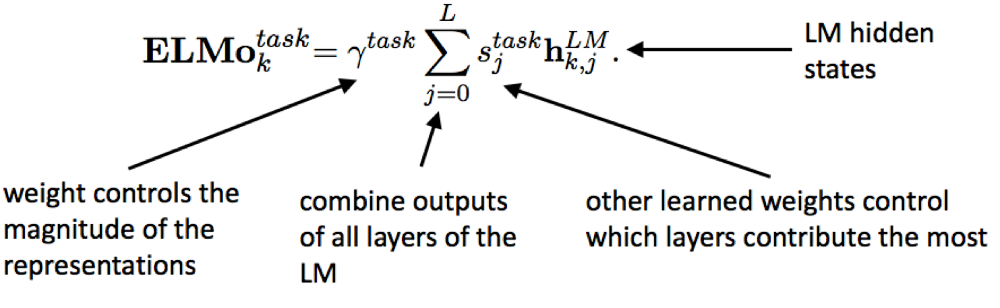

# Fine Tuning Language Models for Multi-label Text Classification

## Overview

Pre-training and generative modeling for improved language understanding for multi-task learning in NLP remains a challenging but interesting area. Currently, most SOTA NLP results are obtained by training end-to-end architectures for each language task. We examine how transformer models relying solely on attention modules, as well as convolution-only modules such as Q-RNN and QANet provide can be used effectively for generative language modeling and then fine-tuned for text classification as well as general multi-task problems. Of particular interest will be multi-label and hierarchical/structured output label classification where graph convolutional and value networks are more effective than binary categorical cross-entropy networks.

## Research Overview

In the past few months, a number of techniques utilizing pre-training, generative modeling, multi-task architectures, data augmentation using back-translation, and efficiency techniques in language modeling have been implemented that have allowed faster training and greater scope for transfer learning. In particular, the five papers below tackle the problem of generative pre-training and multi-task learning in NLP and achieve SOTA results.

1. [OpenAI: Improving Language Understanding by Generative Pre-Training](https://blog.openai.com/language-unsupervised/)
    * [code](https://github.com/openai/finetune-transformer-lm)
    * **_tldr_**: Train an unsupervised language model using a transformer architecture, and then fine-tune on task-specific datasets.
2. [fastAI: Universal Language Model Fine-tuning for Text Classification](http://nlp.fast.ai/classification/2018/05/15/introducting-ulmfit.html)
    - [code](https://github.com/fastai/fastai/tree/master/fastai) 
    * **_tldr_**: Pre-train a language model on generic English corpus (i.e., Wikipedia). Use that to initialize a new language model on your unlabeled domain-specific corpus. Fine-tune / initalize a new domain-specific architecture for text classification.

    

3. [Google Brain: QANet: Combining Local Convolution with Global Self-Attention for Reading Comprehension](https://arxiv.org/pdf/1804.09541.pdf)
    - [code](https://github.com/ni9elf/QANet)
    - **_tldr_**: Train a transformer based Q&A model consisting solely of convolutions and self-attentions. Convolutions model local interactions, and self-attention models global interactions. Use back-translation from Google [NMT](https://github.com/tensorflow/nmt) for data augmentation. Current #1 on SQuAD.
4. [AllenAI: Deep Contextualized Word Vectors](https://arxiv.org/abs/1802.05365)
    - [code](https://github.com/allenai/allennlp/blob/master/tutorials/how_to/elmo.md)
        * [tensorflow implementation](https://github.com/allenai/bilm-tf)
    - **_tldr_**: Train a generic language model using Bidirectional-LSTM. 
    
5. [Salesforce Research, The Natural Language Decathlon](https://einstein.ai/research/the-natural-language-decathlon)
    - [code: github.com/salesforce/decaNLP](https://github.com/salesforce/decaNLP)
    - **_tldr_**: Challenge consisting of ten NLP tasks: : question answering, machine translation, summarization, natural language inference, sentiment analysis, semantic role labeling, relation extraction, goal-oriented dialogue, database query generation, and pronoun resolution. Proposed MQAN (multi-task question answering network) which uses bidirectional LSTM to encode both question and context document, dual coattention, compressed further using another two BiLSTMs + self-attention + two more BiLSTMs to obtain final representations.

    

## Data

The task-specific dataset we will examine is a corpus of scientific articles from PubMed, collected and distributed by the NLM and the [BioASQ](http://bioasq.org/) challenge.

- 14 million abstracts, titles and MeSH (medical subject heading labels)
- hierarchy of parent to child label headings