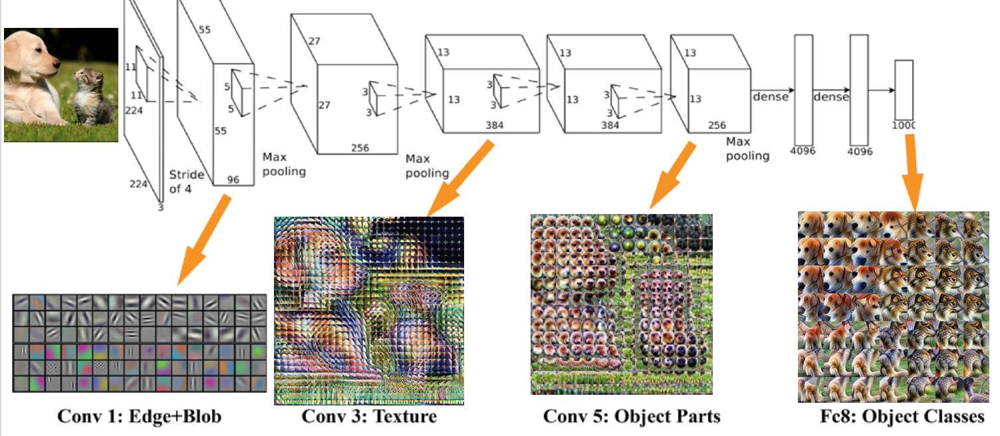
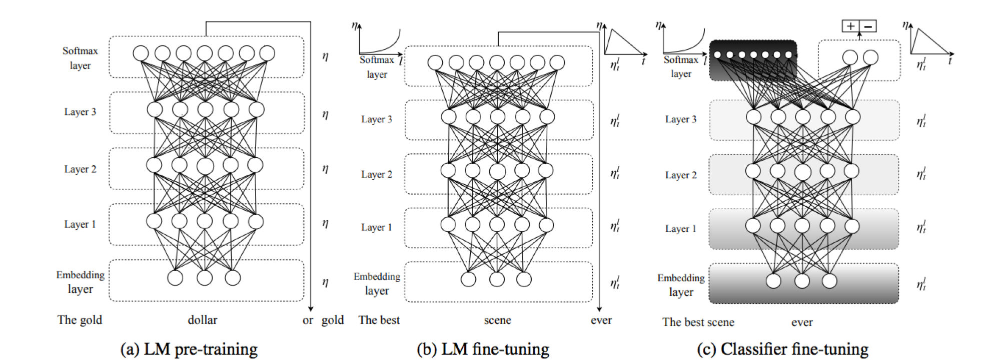
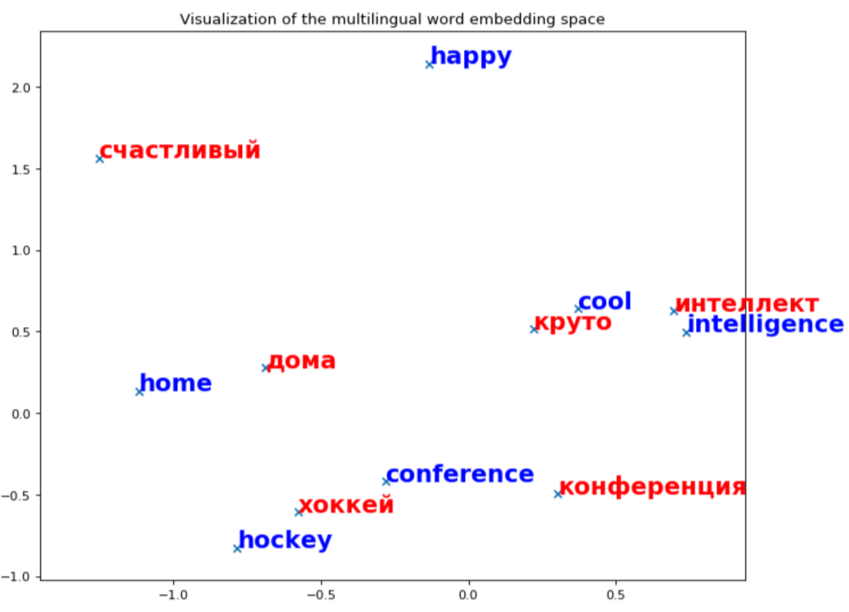
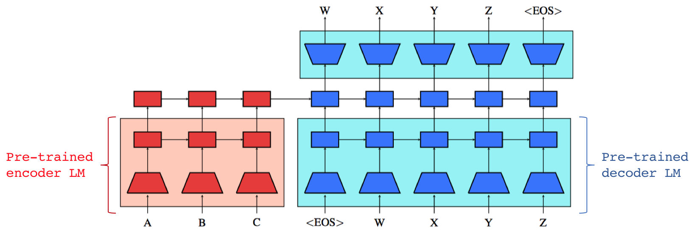

```{r setup, include=FALSE}
options(htmltools.dir.version = FALSE)
```

```{r xaringan-themer, include=FALSE}
library(xaringanthemer)
mono_accent(
  base_color = "#607ED1",
  code_font_family = "Fira Code",
  code_font_url    = "https://cdn.rawgit.com/tonsky/FiraCode/1.204/distr/fira_code.css"
)

# mono_accent_inverse(
#   base_color = "#5B88A6",
#   code_font_family = "Fira Code",
#   inverse_header_color = "#000000",
#   code_font_url    = "https://cdn.rawgit.com/tonsky/FiraCode/1.204/distr/fira_code.css"
# )
```

## Capacity and Inductive Biases
### Learning Curves: Learning from Experience


---

## Pre-Training and Knowledge Sharing
### Success in Vision from Pre-Trained Models

--



--

* In CV, combination of ImageNet and CNNs has been a big success
    - enabled highly performant models
    - better understanding of the models
    - more inspired from how perception/vision may work
* NLP:
    - still stuck on word embeddings
    - single-task models

---

background-image: url("https://thumbs.gfycat.com/OrangeSinfulAcornbarnacle-max-14mb.gif")
background-size: cover

>You can't cram the meaning of a whole %&!$ing sentence into a single $&!*ing vector!

Ray Mooney

---

## Data Scarcity, Non-generalizeable Features


Dataset | Domain | Size (#sentences)
---------|----------|---------
 CoNLL 2003 | NER | 15K
 OntoNotes | Coreference Resolution | 75K
 PTB | Parsing | 40K
 SQuAD | QA | 100K
 SNLI | Entailment | 570K
 SST | Sentiment | 10K

--

- Most SOTA NLP results are obtained by training end-to-end architectures for each language task. 
- Most datasets are in English, and are very small.
- Not much knowledge sharing, or re-use
- Single task learning inhibits us from general language understanding, and exposes us to learning overly discriminative features that generalize poorly


---

## Representations of Language
### Language Modeling

* **Goal**:  predict the next word given the preceding words

* Given a sequence of words $x^{(1)}, x^{(2)},\ldots,x^{(t)}$, compute the CPD:

$$
\mathbb{P}\left(x^{(t+1)}=w_j \vert x^{(t)},\ldots,x^{(1)}\right)
$$

---

## Literature Review

### Fine-Tuning Language Models

1. [OpenAI: Improving Language Understanding by Generative Pre-Training](https://blog.openai.com/language-unsupervised/)
    * **_tldr_**: Train an unsupervised language model using a transformer architecture, and then fine-tune on task-specific datasets.
2. [fastAI: Universal Language Model Fine-tuning for Text Classification](http://nlp.fast.ai/classification/2018/05/15/introducting-ulmfit.html)
    * **_tldr_**: Pre-train a language model on large unlabelled corpus. Initialize new language model on your unlabeled domain-specific corpus. Fine-tune task-domain-specific architecture for text classification.
    

---

## Generative Language Modeling Helps

### Common Sense Reasoning

3. [Trieu H. Trinh & Quoc Le: A Simple Method for Commonsense Reasoning](https://arxiv.org/abs/1806.02847)
    - **__tldr__**: Solve multiple choice questions from _Pronoun Disambiguation Challenge_ and _Winograd Schema Challenge_ by pre-training many language models (diversity helps!), substitute question in sentence, pick one with highest likelihood on the LMs (using ensembling).
    
    


---

## Transformer Training on TPUs
### Pre-Trained Language Models

* Implementation in `tensor2tensor`:
* Define `data_generator` for source data to `tensor2tensor/data_generator`
    - decorate with `@registry.register_problem`
    - annotate necessary methods, i.e., `approx_vocab`
* Add it to `all_problems.py` list in `tensor2tensor` library
* Language model on wikitext-103: took ~12 hours on TPU to attain perplexity of 53.2, very close to the [SOTA reported perplexity](https://arxiv.org/pdf/1708.02182.pdf)


Language | Dataset | Perplexity
---------|----------|---------
 English | wikitext-103 | 53.2
 Russian | Lenta.ru + ru.wiki | 35.4
 Korean | ko.wiki | 48.3
 Jeju-eo | dictionary + oral conversation | 31.4
 
 
---

## Unsupervised Neural Machine Translation
## Adversarial Alignment of Embedding and Sentence Encoders 

--


--

$$\mathcal{L}_{\mathcal{D}}\left(\theta_{\mathcal{D}}\vert\boldsymbol{W}\right)=-\frac{1}{n}\sum_{i=1}^{n}\log P_{\theta_{\mathcal{D}}}\left({\rm source}=1\vert W_{x_{i}}\right)-\frac{1}{m}\sum_{i=1}^{m}\log P_{\theta_{\mathcal{D}}}\left({\rm source}=0\vert y_{i}\right)$$
* complete implementation: [`src/scripts/opennmt-unmt`](https://github.com/akzaidi/fine-lm/tree/master/src/scripts/opennmt-unmt)
* instructions: [`github.com/akzaidi/fine-lm#neural-machine-translation-baselines`](https://github.com/akzaidi/fine-lm#neural-machine-translation-baselines)

---

## Unsupervised Neural Machine Translation

### Shared English-Russian Embeddings




---

## Transformer Language Models
### TPU Training with `Tensor2Tensor`

.pull-left[

- Bidirectional LSTMs have become the workhorse for encoder-decoder Seq2Seq Models
- Good:
    * perhaps the proper inductive bias: iterative/recursive transformations
- Some limitations: 
    * inherently sequential (hard to parallelize)
    * forgetting ("LSTMs work in practice, but can they work in theory?")
]

--

.pull-right[

- Transformers:
    * Relies solely on self-attention to learn long dependencies 


]

---

## Initializing Machine Translation with Pre-Trained Encoder Decoder

* Rather than starting from random weights, initialize NMT system with LM encoder and decoder of source and target language respectively



---

## Improved Initializations

```{r learncurves-nmt, echo=FALSE, message=FALSE, warning=FALSE, fig.width=11}
library(tidyverse)
library(hrbrthemes)
extrafont::loadfonts()
# theme_set(theme_modern_rc(base_size = 36))
theme_set(theme_ipsum_rc(base_size = 36))

data.frame(df_sample = rep(c(0.2, 0.4, 0.6, 0.8, 1), 2), 
           bleu = c(0.12, 0.21, 0.24, 0.25, 0.31, 
                    0.27, 0.34, 0.37, 0.38, 0.39), 
           init = c(rep("none", 5), 
                    rep("pre-LM", 5))) %>% 
  ggplot(aes(x = df_sample, y = bleu, colour = init)) + 
  geom_point() + geom_line()  + 
  geom_smooth() + 
  labs(title = "NMT Scores for English-Korean",
       subtitle = "Random Initialization vs Pre-Trained LM",
       x = "percentage of labeled data used") + 
  theme(axis.title = element_text(size=24),
        axis.title.x = element_text(size=24),
        axis.title.y = element_text(size=24),
        plot.title = element_text(size=30),
        plot.subtitle = element_text(size=26),
        plot.caption = element_text(size=24))
```


---

## Low-Resource NMT
### Semi-Supervised NMT

* As a second experiment, we examine translation into the low-resource language of [Jeju-eo](https://en.wikipedia.org/wiki/Jeju_language)
* Can be considered a dialect of Korean but is significantly different
* According to the UNESCO Atlas of the World's Endangered Languages, Jejeueo is critically endangered
    - Only 5,000-10,000 people speak the Jeju language
    - All current speakers > 70–75 years of age
    - No teaching mechanism for the youth
* Utilize Jeju-eo oral stories translated by library 

--

Initialization | Ko-Je BLEU
---------|----------
None | 30.89
Ko-LM, Je-RW | 44.31
Ko-LM, Je-Ko_LM | 46.41

---

background-image: url(https://img00.deviantart.net/2954/i/2012/025/d/8/our_work_is_never_over_by_mydegeneration-d4nkwke.png)
background-size: cover
class: inverse

## Next Steps
### Our Work is Never Over

* Release all models!
* Encoder Alignment
    - interpolation
    - improvement with multiple encoders
* Multi-way NMT
    - e.g., Jeju-eo incorporates words from Japanese, Chinese and Mongolion
* Ablation studies
    - comparisons against Bi-LSTMs
    - various tokenizers sub-word encoders
* Transfer learning for discriminative tasks
    - multi-lingual NLP decathlon
* Train on diverse datasets
    - conversational data, i.e., `namu.wiki`
* Examine performance of Universal Transformer

---

class: center
background-image: url(https://cdn-images-1.medium.com/max/2000/1*IfjQyGlgAIo8yCvZwtk4CA.jpeg)
background-size: cover


# Thanks!

<p><font size="4" color="black">Thanks to TF Korea, the Oh S crew, all the wonderful organizers and mentors ♥Bitnoori, SangJin, Terry, Soonson, Wonchang, Eric!!</font></p>

<br>
<br>
<br>
<br>
<br>
<br>
<br>
<br>
<br>
<br>
<br>
<br>

<p><font size="5" color="white">Thanks to my mentor Minjoon Seo!</font></p>

<p><font face="monospace" color="white">github.com/akzaidi/fine-lm</font></p>


---


class: center
background-image: url(imgs/dljejupz.gif)
background-size: cover

<p><font size="7" color="black">고맙습니다. 다음에 봐! </font></p>
<p><font size="7" color="red">잘 잤어 &#x1f48b; </font></p>