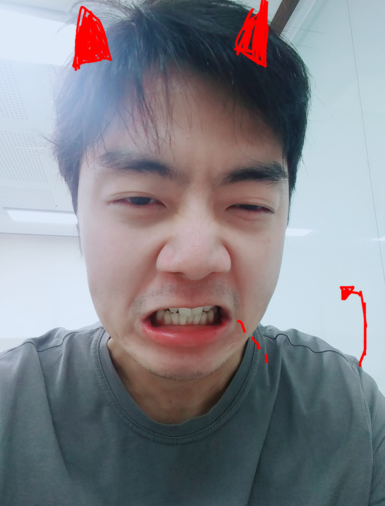
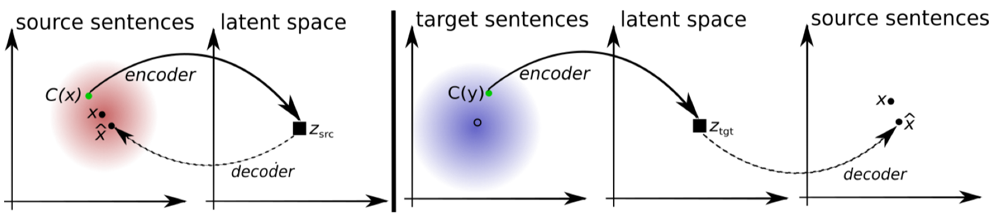

```{r setup, include=FALSE}
options(htmltools.dir.version = FALSE)
```

```{r xaringan-themer, include=FALSE}
library(xaringanthemer)
mono_accent_inverse(
  base_color = "#5B88A6",
  code_font_family = "Fira Code",
  inverse_header_color = "#000000",
  code_font_url    = "https://cdn.rawgit.com/tonsky/FiraCode/1.204/distr/fira_code.css"
)
```

# 




---


## Language Models and Baseline NMT Model

1. Trained a Transformer language model on WikiText-103 using 
1. Baseline Transformer language model for Korean on Sherlock Holmes and other books
1. Baseline NMT model for KO-EN, using 2017 parallel corpus using 
    * [Korean English Parallel Corpus](https://sites.google.com/site/koreanparalleldata/)
        - 96,982 sentence-aligned corpus sentence pairs from the newswire articles collected from the Web (mostly from Yahoo! Korea and Joins CNN during 2010 and 2011
        
---

## Unsupervised Neural Machine Translation

$$\mathcal{L}_{\mathcal{D}}\left(\theta_{\mathcal{D}}\vert\boldsymbol{W}\right)=-\frac{1}{n}\sum_{i=1}^{n}\log P_{\theta_{\mathcal{D}}}\left({\rm source}=1\vert W_{x_{i}}\right)-\frac{1}{m}\sum_{i=1}^{m}\log P_{\theta_{\mathcal{D}}}\left({\rm source}=0\vert y_{i}\right)$$



1. Autoencoder for reconstructing sentences from monolingual pairs
    - in order to prevent memorization, denoisy autoencoders to add random noise
1. Cross-domain training: backtranslation of source sentence using shared sentence encoder into target sentence
    - creates new noisy sentences
1. Adversarial training: add discriminator aiming to distinguish between input representations 
1. Korean-Jeju NMT Model:
  1. [제주어 구술 자료집](http://archive.jst.re.kr/jejustudiesDBList.do?cid=080100): Jeju-eo language dictionaries
  1. [우리말샘 제주어 표제어 및 예문](https://opendict.korean.go.kr/main): Jeju-eo / Korean headlines

---

# Preliminary Results

---

## Next Steps

- Transfer from language models -> NMT models using shared lexical representation
    * explicitly contain subword embeddings across many languages (e.g., Japanese)
    * allow for interpolation for top/common words
- Train Transformers for all models (hitting some memory issues)
- Use Naver API for Naver search for evaluation: English/Jeju-eo -> Korean -> English/Jeju-eo
- Checkpoint tokens with their character index to visualize in TensorBoard
- MoLE (Mixture of Language Experts): gated network of set of language specific networks: $h^{\prime} = \sum^K_k f_k(h) \cdot \text{softmax}(g(h))_k$
- Ablation studies, ensembling
- (Get away from PyTorch)

---

# Thanks!

- [Thanks to my mentor Minjoon Seo!](https://seominjoon.github.io/)
- [`https://github.com/akzaidi/fine-lm`](https://github.com/akzaidi/fine-lm)

